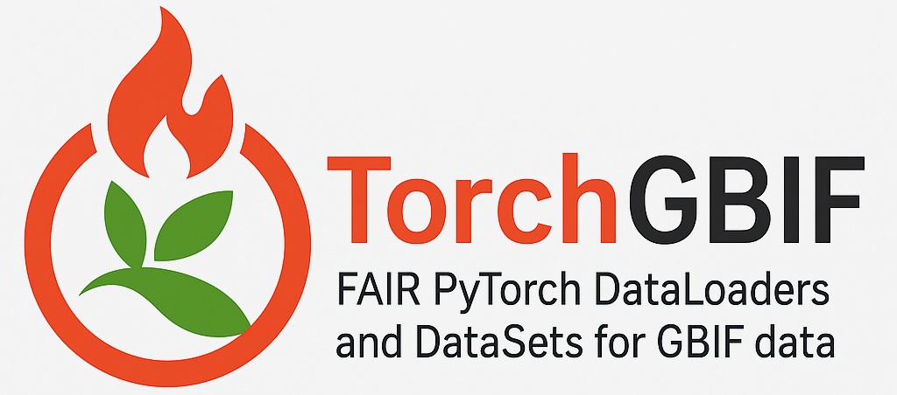

<p align="center">
    
</p>

[](https://badge.fury.io/py/torchgbif)
[](https://opensource.org/license/mit/)

TorchGBIF is a PyTorch library that provides FAIR (Findable, Accessible, Interoperable, Reusable) DataLoaders and DataSets for GBIF (Global Biodiversity Information Facility) data, enabling easy access to biodiversity data for machine learning tasks with research reproducibility.

GBIF is a global network and data infrastructure that provides access to data about all types of life on Earth, including species occurrence records, taxonomic information, images, audio and more.The GBIF API provides acces to this data via SQL queries, however the data itself is not in a format that can be used directly with PyTorch. TorchGBIF provides a set of DataLoaders and DataSets that can be used to easily access GBIF data in a format that is compatible with PyTorch, while automatically generating RO-Crates for FAIR research workflows.

Read the BioHackArxiv paper for more details: [paper.md](paper.md)

## Installation

To install TorchGBIF, you can use pip:

```bash
pip install torchgbif
```

or clone the repository and install it manually:

```bash
git clone https://github.com/thisistaimur/TorchGBIF.git
cd TorchGBIF
pip install -e .
```

## Aviable DataSets

- `GBIFSpeciesDataSet`: A generic dataset for GBIF species occurence data.
- `GBIFImageDataSet`: A dataset for GBIF data with images.
- `GBIFAudioDataSet`: A dataset for GBIF data with audio.

## Semantic versioning

This project uses [semantic versioning](https://semver.org/). The version number is in the format `MAJOR.MINOR.PATCH`, where:

- `MAJOR` version is incremented for incompatible API changes.
- `MINOR` version is incremented for new features that are backward-compatible.
- `PATCH` version is incremented for backward-compatible bug fixes.

Releases are automatically created when tags are pushed. See [.github/RELEASE_PROCESS.md](.github/RELEASE_PROCESS.md) for details on the automated release system.


## Cite as

If you use TorchGBIF in your research, please cite it as follows:

```bibtex
@misc{torchgbif,
  author = {Taimur Khan, },
  title = {TorchGBIF: FAIR PyTorch DataLoaders and DataSets for GBIF data},
  year = {2025},
  publisher = {GitHub},
  journal = {GitHub repository},
  url = {https://github.com/thisistaimur/TorchGBIF}
}
```